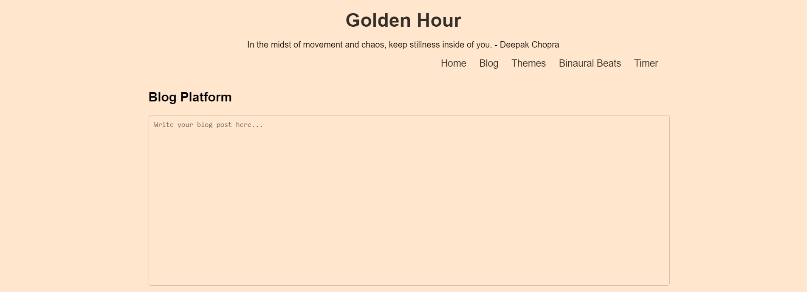
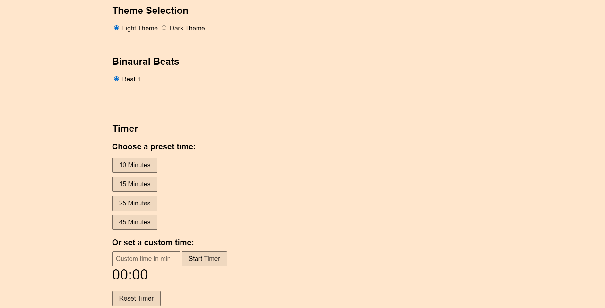
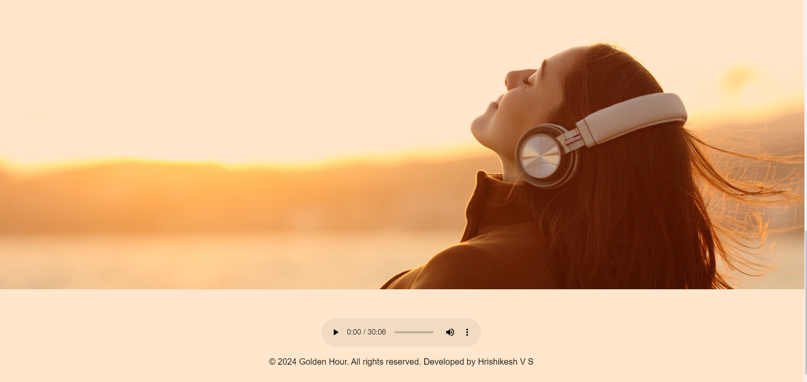

# Golden Hour App

## Description

Golden Hour is a web application that provides various features like a blog platform, theme selection, binaural beats, and a timer. It offers a user-friendly interface and customizable themes for a personalized experience.

## Features

- Blog Platform: Write and manage blog posts.
- Theme Selection: Choose between light and dark themes for the website.
- Binaural Beats: Listen to binaural beats for relaxation and focus.
- Timer: Set countdown timers for various tasks.

## Description

Golden Hour is a web application that provides various features like a blog platform, theme selection, binaural beats, and a timer. It offers a user-friendly interface and customizable themes for a personalized experience.

## Features

- Blog Platform: Write and manage blog posts.
- Theme Selection: Choose between light and dark themes for the website.
- Binaural Beats: Listen to binaural beats for relaxation and focus.
- Timer: Set countdown timers for various tasks.

## Website Link

[Visit Golden Hour](https://hrishikeshvs.github.io/Golden-hour/)

or scan this QR Code -

## Usage

1. Clone the repository: `https://github.com/hrishikeshvs/Golden-hour.git`
2. Open the `index.html` file in your web browser.
3. Explore the features of the Golden Hour app.

## License

This project is licensed under the MIT License - see the [LICENSE](LICENSE) file for details.
)

## Screenshots

## Usage

1. Clone the repository: `git clone https://github.com/hrishikeshvs/Golden-hour.git`
2. Open the `index.html` file in your web browser.
3. Explore the features of the Golden Hour app.

## License

This project is licensed under the MIT License - see the [LICENSE](LICENSE) file for details.
